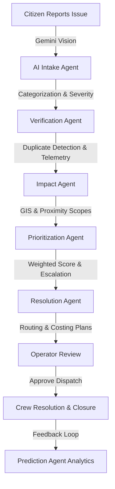
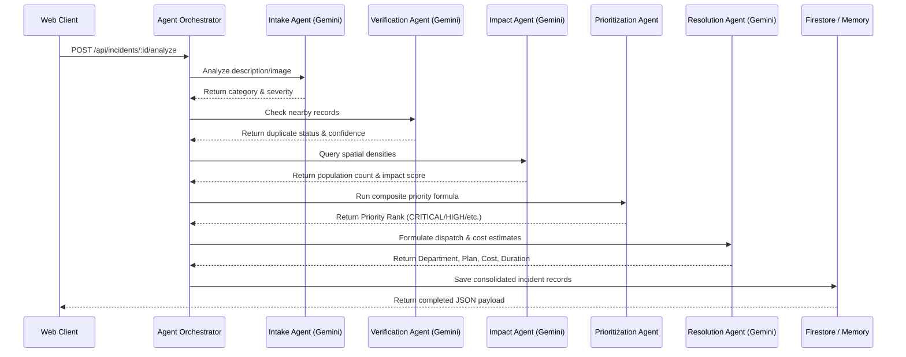

# CivicMind: AI-Agentic Municipal Infrastructure & Issue Resolution Platform
## Comprehensive Architectural Build Plan

---

## 1. Product Vision

### What CivicMind Does
CivicMind is an agent-driven municipal infrastructure management and community-led civic action platform. It replaces passive "311 photo submission" systems with an active, autonomous multi-agent pipeline. It takes raw, unstructured citizen inputs (informal descriptions, photos, voice notes) and converts them into verified, geolocated, prioritized, cost-estimated, and department-routed work orders. Additionally, CivicMind acts as a predictive engine, analyzing historical patterns to forecast infrastructure failures before they impact the public.

```
[ Citizen Report ] ➔ [ AI Agent Intake & Verification ] ➔ [ Auto Dispatch ] ➔ [ Analytics & Hotspots ]
```

### Why It Matters
Modern cities face crumbling infrastructure, but municipal budgets are constrained, and urban repair workflows are plagued by manual delays. Issues like water main ruptures or developing sinkholes can escalate from minor annoyances to multi-million-dollar hazards if left unaddressed. Traditional systems fail because they require citizens to fill out tedious forms and place the burden of classification and priority scoring on overworked city staff. CivicMind automates this entire operational lifecycle, protecting lives, saving tax dollars, and rebuilding trust in local government.

### Who Uses It
1. **Citizens**: Local residents who want to report local hazards, track neighborhood improvements, and participate in community verification.
2. **Community Verifiers**: Trusted local residents who validate reported issues in exchange for gamified points, building local accountability.
3. **Municipal Operators**: Public works dispatchers and team leads who review, edit, and approve auto-generated agentic work orders.
4. **City Administrators**: Leadership (Mayors, Department Heads) who monitor high-level KPIs, budget usage, and system-wide predictive analytics.

### How It Solves the Problem Better Than Traditional Platforms
* **Zero-Friction Reporting**: The user writes in plain language ("water spraying everywhere near the school") and uploads an image. AI handles the classification.
* **Leaflet Maps Integration**: Transitioning from Google Maps to **Leaflet Maps API** (with OpenStreetMap) provides a highly performant, open-source mapping layout. It eliminates API key configuration bottlenecks, supports offline/caching capabilities, and allows deep custom styling (glassmorphism, color-coded status circles, and animated vector layers).
* **Multi-Agent Orchestration**: Instead of single-prompt AI, CivicMind uses a cascading agent chain (Intake ➔ Verification ➔ Impact ➔ Prioritization ➔ Resolution ➔ Prediction) with dedicated reasoning loops.
* **Predictive Threat Modeling**: Instead of reacting to issues, it proactively alerts departments about high-risk utility zones using historical weather, age, and load indicators.

---

## 2. User Personas

| Persona | Role | Goals | Pain Points | Key Workflows |
| :--- | :--- | :--- | :--- | :--- |
| **Citizen Reporter** | Resident / Commuter | Report issues instantly, see visual confirmation of repairs, gain community recognition. | Complex government forms, lack of feedback, feeling ignored by the city. | 1. Double-click Leaflet map to drop pin.<br>2. Upload image and write short description.<br>3. Track issue status via real-time progress map. |
| **Community Verifier** | Active Neighbor | Improve neighborhood safety, verify local reports, climb leaderboards. | Spam issues cluttering feed, no reward for reporting. | 1. Review nearby unverified reports on Leaflet map.<br>2. Submit on-site photo or text evidence.<br>3. Earn trust points and unlock badges. |
| **Municipal Operator** | Public Works Dispatcher | Coordinate maintenance crews, optimize repair budgets, minimize repair duration. | Overflow of duplicate issues, misclassified categories, lack of cost estimates. | 1. Review critical AI-prioritized incidents.<br>2. Inspect recommended resolution plans and cost estimates.<br>3. Approve or adjust routed work orders. |
| **City Administrator** | Director of Public Works / Mayor | Monitor infrastructure health, predict upcoming failures, allocate long-term budgets. | Reactive planning, budget overruns, lack of macro-level hotspot insights. | 1. Analyze high-level health score metrics.<br>2. Inspect predictive risk zones on Leaflet heatmap.<br>3. Export quarterly reports for council meetings. |

---

## 3. End-to-End User Journey



### Detailed Lifecycle Flows
1. **Citizen reports issue**:
   * A citizen notices a ruptured water pipe. They open the CivicMind web application on their mobile phone.
   * The app prompts them to tap "Current Location" (using Leaflet's HTML5 geolocation handler) or double-click on the map to drop a pin.
   * They snap a picture of the rupture, type "water spraying 10 feet into the road", and click Submit.
2. **AI Intake**:
   * The image and description are processed by the **Intake Agent** (via Gemini Vision).
   * The agent sanitizes the input, extracts the issue type (`Water & Sewage`), and flags an initial severity rating of `5` based on safety hazards.
3. **Verification**:
   * The **Verification Agent** performs a geospatial query (within a 500-meter radius) in Firestore.
   * It determines if there are existing tickets matching the category. If yes, it groups them under a parent ticket. If not, it marks the incident as verified, leveraging community upvotes to increase confidence.
4. **Impact Assessment**:
   * The **Impact Agent** queries local GIS layers. It detects that the coordinates are 150m from a major hospital and 200m from a light-rail station.
   * It calculates the affected population metric ($8,500$ people) and flags a high density impact score of `5/5`.
5. **Prioritization**:
   * The **Prioritization Agent** calculates the priority rank using the composite formula:
     $$\text{Priority Score} = \text{Severity } (5) + \text{Impact } (5) + (\text{Verification Conf } [0.95] \times 2) + \text{Age Factor } (2.6) = 14.5$$
     This triggers an upgrade to `CRITICAL` status and escalates the ticket to Level 3.
6. **Resolution Recommendation**:
   * The **Resolution Agent** matches the issue to the *Water & Sewerage Authority*.
   * It automatically generates a step-by-step repair checklist, estimates the repair cost at `$12,500` (based on historical local contractor rates), and sets an estimated duration of `8 hours`.
7. **Tracking & Approval**:
   * The incident appears at the top of the **Municipal Control Tower** dashboard with a pulsing red marker.
   * The Operator reviews the AI recommendation, notes the low-risk duplicate check, and clicks "Approve Dispatch" with a single click.
8. **Closure & Gamification**:
   * A field crew repairs the water main and uploads a resolution photo.
   * The status switches to `RESOLVED` on the public Leaflet map.
   * The citizen reporter receives an SMS notification saying "Issue Resolved!" along with a link showing the final patch. They are awarded $+50$ Trust Points and a "Civic Guardian" badge.
9. **Analytics & Predictions**:
   * The **Prediction Agent** runs on the updated database. It correlates this water main burst with soil erosion and historical pipe age data.
   * It updates the Leaflet predictive layer with a red shaded circle showing a high-risk failure hotspot for adjacent water lines, prompting pre-emptive utility inspection.

---

## 4. System Architecture

CivicMind is designed as a cloud-native, decoupled, event-driven web application. It leverages lightweight static assets on the frontend and an agentic orchestration layer on the backend.

```
       +--------------------------------------------------------+
       |                  Frontend (Vite + React)              |
       |  - Leaflet Maps API (OpenStreetMap Tiles)              |
       |  - Tailwind CSS & Glassmorphism UI                     |
       |  - Lucide Icons & Responsive Views                     |
       +----------------------------+---------------------------+
                                    |
                                    | HTTPS / JSON
                                    v
       +--------------------------------------------------------+
       |               Backend (Express + Node.js)              |
       |  - REST APIs (Incidents, Predictions, Gamification)    |
       |  - Agent Orchestrator (Sequencing Chain)               |
       |  - Simulated & Live AI Failover Logic                  |
       +-------+--------------------+-------------------+-------+
               |                    |                   |
               | Vertex AI SDK      | Firestore SDK     | Cloud Storage SDK
               v                    v                   v
      +-----------------+   +---------------+   +---------------+
      |  AI Services    |   |  Database     |   |  Blob Storage |
      |  - Gemini 3.5   |   |  - Firestore  |   |  - Cloud      |
      |    Flash        |   |    JSON       |   |    Storage    |
      |  - Gemini       |   |    Documents  |   |    (Images)   |
      |    Vision       |   +---------------+   +---------------+
      +-----------------+
```

### Data Flow Overview
1. **Submit**: Client uploads metadata and image to Express Server ➔ Image goes to Cloud Storage, metadata goes to Firestore.
2. **Analyze**: Server calls the Agent Orchestrator ➔ Coordinates Gemini API requests with system instructions.
3. **Persist**: Agent thoughts and JSON outputs are written back to the Firestore `incidents` document.
4. **Broadcast**: Leaflet Map on client polls or receives real-time Firestore snapshots (via WebSocket or listener) to draw pins.

---

## 5. Multi-Agent Design

Each agent acts as a specialized worker in the pipeline, executing localized logic before passing control to the next agent.



### Agent Specifications

#### 1. Intake Agent
* **Purpose**: Parse raw descriptions and images to extract clean, standardized variables.
* **Inputs**: `title`, `rawDescription`, `imageUrl`.
* **Outputs**: `issue_type` (Enum), `severity` (1-5), `confidence` (0-1), `location_desc`, `detailed_description`, `agentThought`.
* **Internal Reasoning**: Checks keywords and visual cues. If an image is provided, it runs visual threat detection to identify severe structural integrity risks (cracks, flooding, fire).
* **Tool Access**: Gemini Vision API, translation libraries (for multi-language reports).
* **Failure Handling**: If Gemini is offline, falls back to local regex keyword mapping.
* **Escalation Strategy**: If classification confidence is $<0.5$, routes to the general "Public Works" bucket for manual Operator triage.

#### 2. Verification Agent
* **Purpose**: Block duplicate submissions and verify report validity.
* **Inputs**: Coordinates (`lat`, `lng`), current incident category, existing active incidents list.
* **Outputs**: `verified` (Boolean), `duplicate_group` (String or null), `confidence` (0-1), `agentThought`.
* **Internal Reasoning**: Checks spatial distance to nearby active issues of the same type. If distance is $<200\text{m}$, it triggers semantic comparison on descriptions to check if they describe the same event.
* **Tool Access**: Geospatial query runner over Firestore.
* **Failure Handling**: Defaults to `verified: true` with a lower confidence rating.
* **Escalation Strategy**: Flags suspicious coordinates (e.g., in water bodies or outside city limits) for instant operator rejection.

#### 3. Impact Agent
* **Purpose**: Measure the community footprint and risk to high-density areas.
* **Inputs**: coordinates, category, severity.
* **Outputs**: `impact_score` (1-5), `affected_population` (Integer), `reasoning`, `agentThought`.
* **Internal Reasoning**: Queries proximity parameters against spatial databases (distance to schools, hospitals, bridges, transit lines). High severity + proximity to vulnerable zones = higher impact score.
* **Tool Access**: GIS/Demographics boundary lookup API.
* **Failure Handling**: Defaults to a baseline score based solely on issue category.
* **Escalation Strategy**: Directly flags "Critical Infrastructure Impact" if the incident is within 100 meters of hospitals or power substations.

#### 4. Prioritization Agent
* **Purpose**: Calculate operational triage rankings mathematically to ensure objectivity.
* **Inputs**: `severity`, `impact_score`, `verification_confidence`, ticket age.
* **Outputs**: `priority_score` (Float), `priority_rank` (Enum), `escalation_level` (1-3).
* **Internal Reasoning**: Applies the composite weighted risk formula:
  $$\text{Priority Score} = \text{Severity} + \text{Impact} + (\text{Confidence} \times 2) + \text{Age Factor}$$
  Maps results to ranks: Low ($<6$), Medium ($6\text{--}9$), High ($9\text{--}12$), Critical ($\ge 12$).
* **Tool Access**: Internal scoring utility.
* **Failure Handling**: Uses default weights with a fallback priority of `MEDIUM`.

#### 5. Resolution Agent
* **Purpose**: Build a dispatch routing plan, cost estimate, and action list.
* **Inputs**: Category, severity, priority, description.
* **Outputs**: `department` (String), `recommended_action` (String), `estimated_cost` (Integer), `estimated_duration` (String).
* **Internal Reasoning**: Maps the problem domain to municipal departments. Uses historical average costs for similar issues (e.g., standard patch vs. full repaving) to suggest a budget.
* **Tool Access**: Historic repair catalog dataset query.
* **Failure Handling**: Routes to "Public Works Department" with standard baseline costs.

#### 6. Prediction Agent
* **Purpose**: Identify high-risk infrastructure failure points proactively.
* **Inputs**: Historic incident coordinates, dates, categories, sensor inputs.
* **Outputs**: `risk_zones` (Array of Hotspots), `predicted_failures` (Array of Forecast items).
* **Internal Reasoning**: Runs spatial clustering (similar to DBSCAN) on historic incident locations. Correlates high clusters with infrastructure age to map risk zones.
* **Tool Access**: Clustering models, forecast regression API.

---

## 7. Google Technology Mapping

| Google Service | Purpose | Data Flow | Reason for Selection |
| :--- | :--- | :--- | :--- |
| **Gemini 3.5 Flash** | Core text parsing, verification logic, and resolution drafting. | User description ➔ Gemini ➔ Structured JSON output saved to Firestore. | Extremely fast, supports structured JSON schema outputs, budget-friendly for hackathons. |
| **Gemini Vision** | Photo analysis of reported civic issues. | Uploaded image ➔ Gemini Vision ➔ Category/severity analysis. | Auto-categorizes issues directly from photos, eliminating manual form input. |
| **Vertex AI** | Custom agent orchestration and prompt tuning. | Prompt config templates ➔ Vertex AI ➔ Backend execution wrapper. | Enterprise-grade security and developer control over LLM lifecycles. |
| **Firebase Auth** | Citizen and Operator identity verification. | Client credentials ➔ Firebase Auth ➔ JWT token returned. | Secures admin panel routes with minimal setup (Google Sign-In, Email/Password). |
| **Firestore** | Real-time database for incidents and predictions. | Express server reads/writes ➔ Firestore ➔ Subscribing client app. | Supports real-time snapshot listeners for live Leaflet map updates. |
| **Cloud Storage** | Secure storage for uploaded incident images. | Client upload ➔ Cloud Storage ➔ Public URL generated. | Highly scalable, integrated with Firestore references. |
| **Cloud Functions** | Serverless background triggers (e.g., running Prediction Agent on ticket closure). | Firestore ticket update trigger ➔ Cloud Function ➔ Re-compute predictions. | Keeps the core API backend lightweight and event-driven. |
| **Cloud Run** | Dockerized hosting for the Node.js API backend. | Client HTTP request ➔ Cloud Run instance ➔ JSON API response. | Scalable, autoscales to zero to control costs, supports modern Node runtime. |
| **BigQuery** | Warehouse for historical civic records and sensor data. | Firestore collections (periodic sync) ➔ BigQuery ➔ Prediction Agent query. | Excellent for running geospatial aggregation queries on thousands of points. |
| **Looker Studio** | Executive dash reports for city administrators. | BigQuery dataset ➔ Looker Studio reports ➔ Embedded admin view. | Easily builds rich, interactive dashboards without writing custom UI code. |

---

## 8. Database Design

CivicMind uses **Firestore** as its primary database. The document-based schema is structured for quick geospatial indexing and real-time updates.

### Firestore Collections & Schemas

#### 1. `users`
```typescript
// Collection: users
// Document ID: userId (from Firebase Auth)
{
  id: string,
  name: string,
  email: string,
  role: 'CITIZEN' | 'VERIFIER' | 'OPERATOR' | 'ADMIN',
  avatarUrl: string,
  createdAt: string,
  trustScore: number,          // Gamification metric (0 to 100)
  totalPoints: number,         // Citizen points balance
  badgesEarned: string[]       // Array of badge IDs
}
```

#### 2. `reports` (Unfiltered Citizen Submissions)
```typescript
// Collection: reports
// Document ID: reportId
{
  id: string,
  title: string,
  rawDescription: string,
  imageUrl: string | null,
  location: {
    lat: number,
    lng: number,
    address: string
  },
  reporterId: string,          // Reference to users collection
  createdAt: string,
  status: 'SUBMITTED' | 'PROCESSED'
}
```

#### 3. `incidents` (Consolidated City Tickets)
```typescript
// Collection: incidents
// Document ID: incidentId
{
  id: string,
  title: string,
  rawDescription: string,
  imageUrl: string | null,
  location: {
    lat: number,
    lng: number,
    address: string
  },
  reporter: {
    name: string,
    email: string,
    avatar?: string
  },
  createdAt: string,
  status: 'SUBMITTED' | 'ANALYZING' | 'VERIFIED' | 'PRIORITIZED' | 'RESOLVING' | 'RESOLVED' | 'REJECTED',
  upvotes: number,
  downvotes: number,
  evidence: Array<{
    id: string,
    author: string,
    text: string,
    createdAt: string
  }>,
  
  // Agent Outputs
  intake?: {
    issue_type: string,
    severity: number,
    confidence: number,
    location_desc: string,
    detailed_description: string,
    agentThought: string
  },
  verification?: {
    verified: boolean,
    duplicate_group: string | null,
    confidence: number,
    agentThought: string
  },
  impact?: {
    impact_score: number,
    affected_population: number,
    reasoning: string,
    agentThought: string
  },
  prioritization?: {
    priority_score: number,
    priority_rank: 'LOW' | 'MEDIUM' | 'HIGH' | 'CRITICAL',
    escalation_level: number,
    agentThought: string
  },
  resolution?: {
    department: string,
    recommended_action: string,
    estimated_cost: number,
    estimated_duration: string,
    approvedByOperator: boolean,
    operatorOverridden: boolean,
    agentThought: string
  }
}
```

#### 4. `predictions` (Hotspot forecasts)
```typescript
// Collection: predictions
// Document ID: predictionId
{
  id: string,
  confidence_scores: number,
  generatedAt: string,
  agentThought: string,
  risk_zones: Array<{
    id: string,
    zone: string,
    risk_score: number,
    primary_vulnerability: string,
    lat: number,
    lng: number,
    radius: number
  }>,
  predicted_failures: Array<{
    id: string,
    item: string,
    estimate_time: string,
    confidence: number,
    category: string,
    location: string
  }>
}
```

#### 5. `leaderboards` (Gamification rankings)
```typescript
// Collection: leaderboards
// Document ID: leaderboardId
{
  id: string,
  period: 'WEEKLY' | 'MONTHLY',
  entries: Array<{
    userId: string,
    name: string,
    avatarUrl: string,
    pointsEarned: number,
    rank: number
  }>
}
```

---

## 8. API Design

All endpoints require JSON payloads and return standardized responses.

### 1. `GET /api/incidents`
* **Description**: Retrieve a list of active incidents.
* **Authentication**: None (Public)
* **Response Body**:
  ```json
  [
    {
      "id": "inc-1",
      "title": "Water Main Rupture",
      "status": "RESOLVING",
      "location": { "lat": 37.7794, "lng": -122.4132, "address": "850 Grand Ave" }
    }
  ]
  ```

### 2. `POST /api/incidents`
* **Description**: Submit a new citizen report.
* **Authentication**: Firebase Token (Required for point rewards, optional for anonymous submission)
* **Request Body**:
  ```json
  {
    "title": "Clogged storm drain",
    "rawDescription": "Leaves are completely blocking the street gutter, flooding the bike lane.",
    "address": "400 Pine St, Metropolis",
    "lat": 37.7699,
    "lng": -122.4468,
    "reporterName": "Sarah Connor",
    "reporterEmail": "sarah@connor.net"
  }
  ```
* **Response Body**:
  ```json
  {
    "id": "inc-12345",
    "title": "Clogged storm drain",
    "status": "SUBMITTED",
    "createdAt": "2026-06-22T13:12:00.000Z"
  }
  ```

### 3. `POST /api/incidents/:id/analyze`
* **Description**: Triggers the multi-agent execution pipeline.
* **Authentication**: Session Required (Citizen or Operator)
* **Response Body**: Returns the updated incident document including all agent outputs and thoughts.

### 4. `POST /api/incidents/:id/operate`
* **Description**: Allows municipal operators to override prioritizations, change departments, update budgets, or approve work orders.
* **Authentication**: Operator Role Required
* **Request Body**:
  ```json
  {
    "priorityRank": "HIGH",
    "department": "Department of Transportation",
    "estimatedCost": 4800,
    "approveAction": true
  }
  ```
* **Response Body**: Updated incident document.

### 5. `GET /api/predictions`
* **Description**: Fetch risk zones and predicted failures from the Prediction Agent.
* **Authentication**: None (Public for transparency, editable by Admin)

---

## 9. AI Pipeline Design

Here is the exact lifecycle of an uploaded image and report traveling through the Gemini AI pipelines.

```
+------------------+
| Uploaded Image & |
| Raw Description  |
+--------+---------+
         |
         v
+-----------------------------+
|    Gemini Vision API        |
| - Identifies objects & tags |
| - Verifies photo validity   |
+--------+---------+
         |
         v
+-----------------------------+
|    Classification Agent     |
| - Map to: Water & Sewage,   |
|   Roads, Grid, Parks        |
+--------+---------+
         |
         v
+-----------------------------+
|   Severity Analysis Agent   |
| - Rate threat level (1-5)   |
+--------+---------+
         |
         v
+-----------------------------+
|   Duplicate Detection       |
| - Geospatial overlap query  |
+--------+---------+
         |
         v
+-----------------------------+
|   Impact & Priority Engine  |
| - Calculate score & rank    |
+--------+---------+
         |
         v
+-----------------------------+
|   Resolution & Pricing      |
| - Outline actions & costs   |
+--------+---------+
         |
         v
+-----------------------------+
| Firestore Document Update   |
+-----------------------------+
```

### JSON Execution Example (Intake Agent Output)
```json
{
  "issue_type": "Road Infrastructure",
  "severity": 4,
  "confidence": 0.96,
  "location_desc": "Proximity to elementary school crosswalk",
  "detailed_description": "Pothole has eroded the sub-base, creating a deep depression likely to collapse into a sinkhole under load.",
  "agentThought": "Intake Agent: The uploaded photo displays a deep road depression with visible subsurface hollow areas. The location is flagged as a school zone, raising safety hazards to 4/5."
}
```

---

## 10. Gamification System

CivicMind turns civic duty into an engaging community experience, offering rewards while protecting the system from spam.

### Trust Score & Rewards
* **Citizen Points**: Earned by submitting reports ($+10$), adding evidence ($+5$), and verifying other reports ($+15$).
* **Badges**:
  * **First Responder**: Submit your first verified report.
  * **Urban Guard**: Verify 10 nearby incidents.
  * **Pothole Patrol**: Report 5 road infrastructure issues.
* **Trust Score (0-100)**: Users start with a score of 50. Confirmed valid reports increase it ($+2$ per report), while rejected reports or spam submissions decrease it ($-15$ per occurrence).

### Anti-Spam Mechanisms
* **Rate Limiting**: Users are limited to 3 submissions per hour.
* **Trust Threshold**: If a user's Trust Score falls below 20, their reports are automatically routed to a low-priority verification queue and do not trigger immediate AI agent processing.
* **Community Verification Cross-Check**: A report must receive at least 3 upvotes or one verification by a user with a trust score $>80$ to be marked as community-verified.

---

## 11. Analytics Dashboard

### 1. Citizen Dashboard
* **Key Metrics**: Points balance, active reports reported, community verification leaderboard rank.
* **Leaflet View**: Personal dashboard map displaying reports they submitted, color-coded by repair progress, along with nearby reports that need verification.
* **Impact Metrics**: "You helped secure safe roads for 12,000 neighbors."

### 2. Operator Dashboard (Control Tower)
* **Key Metrics**: Active Critical tickets, average time-to-resolution, monthly budget spent vs. allocated.
* **KPI Tiles**:
  * `Avg AI Accuracy`: Rate of operator approvals without modifications ($88.4\%$).
  * `Response Backlog`: Number of issues awaiting approval.
* **Leaflet Map**: Visualizes active city tickets with size-adjusted markers representing priority. Shows toggles for category overlays.

### 3. Administrator Dashboard
* **Key Metrics**: Infrastructure Health Score (calculated as $100 - \text{average priority score of outstanding tickets}$), department performance comparisons, predictive failure hotspots.
* **Heatmaps**: A Leaflet heatmap overlay displaying predictive risk zones calculated by the Prediction Agent.

---

## 12. Demo Script

**Duration**: 5 minutes (Hackathon Presentation)

* **[0:00 - 1:00] The Pitch (Problem & Solution)**:
  * *Speaker*: "Traditional 311 tools are where community feedback goes to die. They are frustrating for citizens and overwhelming for cities. Meet CivicMind—an agentic system that automates the report-to-repair lifecycle. We've replaced complex forms with simple chat-based reporting and switched from costly Google Maps to an open-source, fast **Leaflet Maps** interface."
* **[1:00 - 2:00] The Citizen Flow (Live Submission)**:
  * *Screen*: Presenter opens the Citizen view. Double-clicks the Leaflet map in the school zone.
  * *Action*: Uploads an image of a sinkhole, writes: *"Big hole near the school crosswalk, looks dangerous."* Taps Submit.
  * *Behind the Scenes*: The app calls the backend, uploading the report to Firestore.
* **[2:00 - 3:30] The Agent Pipeline (The Wow Moment)**:
  * *Screen*: Switch to the Control Tower. The new incident pops up.
  * *Action*: Presenter clicks "Run Agentic Pipeline". The UI displays a live, animated step-by-step progress checklist:
    1. *Intake Agent*: Classifies as *Road Infrastructure*, sets Severity to 4.
    2. *Verification Agent*: Confirms coordinates overlap the school zone, cross-checks for duplicates.
    3. *Impact Agent*: Identifies school zone proximity, calculates impact population as 1,200.
    4. *Prioritization Agent*: Calculates score ($11.2/15.0$), flags status as `HIGH`.
    5. *Resolution Agent*: Identifies *Department of Transportation*, recommends concrete void refilling, estimates cost at `$4,800` and duration as `24 hours`.
  * *Speaker*: "Look at the agent thoughts. The AI doesn't just return coordinates; it explains its reasoning at every stage."
* **[3:30 - 4:30] Operator Approval & Predictions**:
  * *Screen*: Operator reviews the details on the Leaflet map and clicks "Approve Dispatch". The marker changes from yellow to red (Active Dispatch).
  * *Action*: Toggle the "Forecast Hotspots" layer. The map displays shaded red circles indicating high-risk zones.
  * *Speaker*: "By analyzing this repair and historical data, our Prediction Agent has highlighted two adjacent zones likely to experience issues, allowing proactive maintenance."
* **[4:30 - 5:00] Wrap-up & Judging Value**:
  * *Speaker*: "CivicMind saves cities money, speeds up repairs, and builds trust with citizens. It's built on Firebase, Leaflet, and Gemini. Thank you!"

---

## 13. MVP Scope

### Must Have (24-48 Hours Hackathon)
* **Leaflet Maps Core**: Complete map setup with OpenStreetMap tiles, custom marker styling, and location pin picking.
* **Intake & Priority Engine**: Express endpoints that call Gemini for incident classification, severity rating, and priority calculations.
* **Control Tower UI**: A dual-view layout (Citizen Submission vs. Operator Review) to demonstrate the core user journey.
* **Agent thought panels**: Displaying the step-by-step reasoning of the agents.

### Should Have
* **Predictive Hotspots**: Drawing predictive risk circles on the Leaflet map based on seeded data.
* **Gamification dashboard**: Live points tracking, badge awards, and leaderboards.
* **Operator overrides**: Endpoints allowing operators to adjust routed departments, budgets, and priority ranks.

### Could Have
* **Firebase authentication**: Real login accounts for Citizens and Operators.
* **Cloud Functions integration**: Automatic background triggers for prediction updates.

### Won't Have (Post-Hackathon)
* **Physical dispatch integration**: Real connections to public works routing software.
* **Smart sensor telemetry**: Actual physical IoT meters stream connections.

---

## 14. Development Roadmap

### Phase 1: Foundation (Hours 0 - 6)
* Set up the Vite + React frontend template.
* Integrate **Leaflet Maps API** (with OpenStreetMap tiles) and verify responsive maps layout and marker rendering.
* Configure Express backend framework.
* *Dependencies*: Node.js and Leaflet setup.

### Phase 2: AI Pipeline (Hours 6 - 16)
* Integrate Gemini SDK on the backend.
* Create system prompts for Intake, Verification, Impact, Prioritization, and Resolution agents.
* Verify structured JSON output parses correctly.
* *Dependencies*: Gemini API keys.

### Phase 3: Agent System Integration (Hours 16 - 28)
* Connect the frontend to the backend `/api/incidents/:id/analyze` agent workflow.
* Create the animated step-by-step progress component on the frontend.
* Implement database schema references.
* *Dependencies*: Phase 2 completion.

### Phase 4: Dashboards & Gamification (Hours 28 - 38)
* Build the Control Tower Operator views and Citizen portal forms.
* Integrate points calculations, badge cards, and leaderboard displays.
* Add predictive hotspot layers.
* *Dependencies*: Phase 3 completion.

### Phase 5: Demo Readiness & Polish (Hours 38 - 48)
* Add smooth animations, glassmorphic styles, and clean navigation.
* Run end-to-end tests using the demo script.
* Write deployment config files.

---

## 15. Competitive Advantage

| Feature / Metric | Traditional 311 Systems | Issue-Reporting Apps | **CivicMind** |
| :--- | :--- | :--- | :--- |
| **Map API Cost** | High (Google Maps keys required) | Medium (Google Maps keys required) | **Zero (Leaflet + OpenStreetMap)** |
| **Intake Process** | Manual forms, slow triage | Simple upload, manual triage | **Instant AI Agent Classification & Vision** |
| **Triage & Priority** | Subjective, first-come first-served | Subjective, manual sorting | **Objective, Formula-driven Priority Indexing** |
| **Resolution Planning** | Manual dispatch, slow routing | Forwarded email notifications | **Auto-generated checksheets & cost estimations** |
| **Forecasting** | Reactive only | Reactive only | **Proactive Predictive Hotspot Analytics** |
| **Engagement** | None | Social sharing only | **Gamified Trust Scores, Badges, and Leaderboards** |
